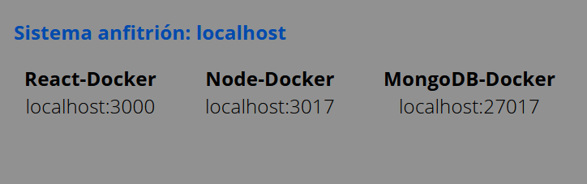
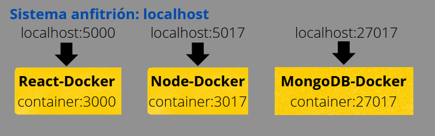
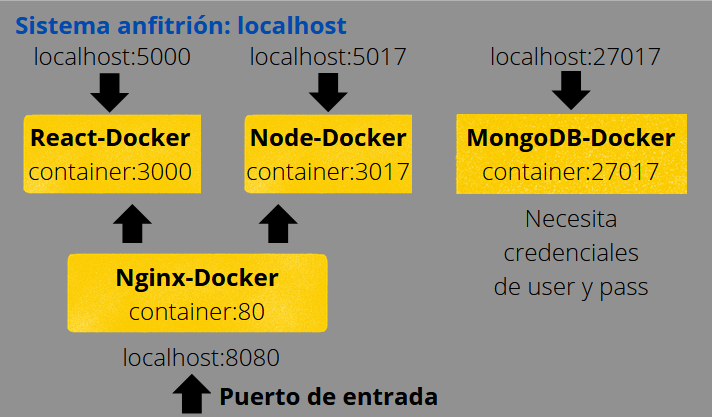
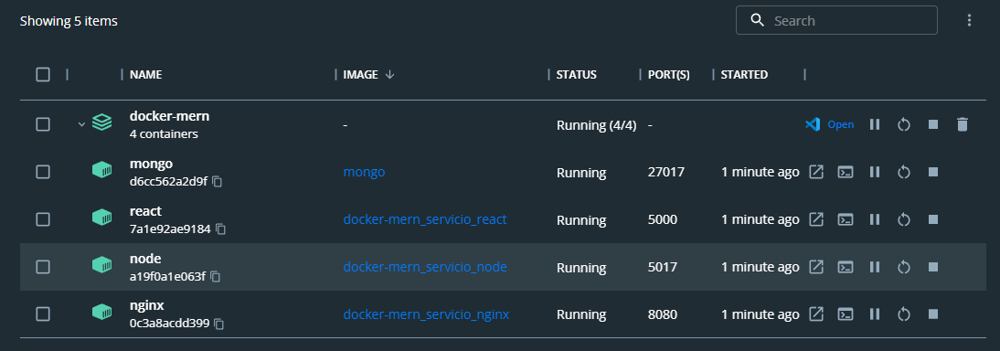
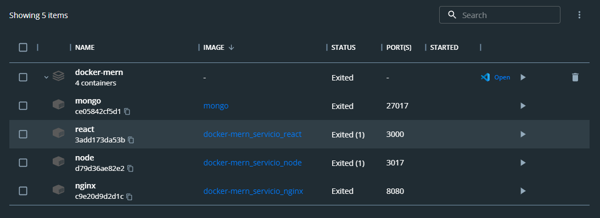

# Stack MERN utilizando contenedores Docker 🚀
_Este proyecto simula un entorno utilizando el stack MERN usando Docker para construir la arquitectura web._


_Primero montaremos el sistema tirando del sistema local, luego construiremos contenedores y por último veremos una forma distinta de acceder utilizando un cotenedor con una imagen de Nginx instalado._


Nota: Este proyecto se centra en temas de arquitectura web, no en como está montado el código tanto del front como el del back.
## :building_construction: Entorno de trabajo: Todo en local (Localhost) :building_construction:
En el primer entorno ejecutamos todo en "localhost" con los puertos que están disponibles:
- En nuestro front con React (puerto 3000)
- Nuestro back con NodeJS (puerto 3017)
- La base de datos MongoDB (puerto 27017)

 
## :building_construction: Entorno de trabajo: Entorno Dockerizado :building_construction:
En el segundo entorno, creamos contenedores para cada una de las partes del proyecto y hacemos "port mapping" con nuestro sistema anfitrión:
- Los servicios de React y Node se contruyen a partir de sus "Dockerfile" correspondientes, para Mongo utilizamos su imagen descargada de Docker Hub
- Hemos mapeado los puertos como se muestra en la imagen de este apartado
- Para el contenedor de React hemos habilitado que se muestre por consola a la hora de ver logs del contenedor
- Los servicios de React y Node utilizan volúmenes de tipo host, mientras que Mongo utiliza volúmenes nombrados
- Las variables de entorno del contenedor de Node a diferencia del de React se implementan a la hora de correr el archivo que monta todos los servicios (docker-compose)
- El contenedor de Node siempre espera a que primero se haya iniciado el contenedor de base de datos MongoDB
- Las variables de entorno que necesita el contenedor MongoDB por definición para la autenticación se incorporan también a la hora de montar todos los servicios

 
## :building_construction: Entorno de trabajo: Utilizando Servidor Nginx como proxy inverso :building_construction:
En este entorno, hemos implementado un servidor Nginx como proxy inverso para que administre las peticiones que le entran por el puerto 8080 de nuestro sistema anfitrión mapeado a nuestro puerto 80 del contenedor que se encarga de esto. Dentro de la configuración de nuestro contenedor Nginx mediante la opción "links" hemos podido establecer la relación con los contenedores de Node y React, además de la propia configuración de Nginx (nginx.conf) establecer como proxy_pass estos servicios con sus respectivos puertos.

<strong>Nota:</strong> Es muy importante recalcar que ahora mismo el sistema tiene muchos puertos abiertos, tanto los que gestiona el servidor web Nginx, como cada contenedor por su cuenta relacionado con el sistema anfitrión. Al ser un proyecto para practicar con Docker dejaremos esto así pero una configuración buena sería cerrar el mapeo de los contenedor de React y Node ya que Nginx ya se encarga de estas redirecciones y dejar solo la conexión del sistema anfitrión con la base de datos por si necesitas hacer alguna consulta por consola con MongoDB.

 
## :hammer_and_wrench: Ambientes de producción y desarrollo :hammer_and_wrench:
Se han generado dos ambientes para nuestro sistema, uno simulando un despliegue de la aplicación en producción y otro en modo desarrollo aplicando los cambios que se realicen al momento para que el/la desarrollador/a pueda ir comprobando el comportamiento de la aplicación. 

Comando para levantar el sistema en modo producción, en segundo plano:
```
docker compose up -d
```

Comando para levantar el sistema en modo desarrollo, en segundo plano:
```
docker compose -f docker-compose.dev.yml up -d
```




Comando para tumbar el sistema, los volúmenes e imágenes se mantienen:
```
docker compose down
```

Comando para tumbar el sistema y llevarte todo por delante, borras contenedores, imágenes y volúmenes:
```
docker compose down --rmi all -v
```

 

<strong>Nota:</strong> El sistema anfitrión es un Windows y hemos utilizado la correspondiente virtualización para este sistema operativo usando Docker Desktop como herramienta de trabajo.

😀 Hecho por [Germán Fernández](https://www.linkedin.com/in/geerdev/) :technologist: